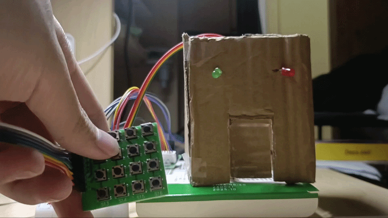
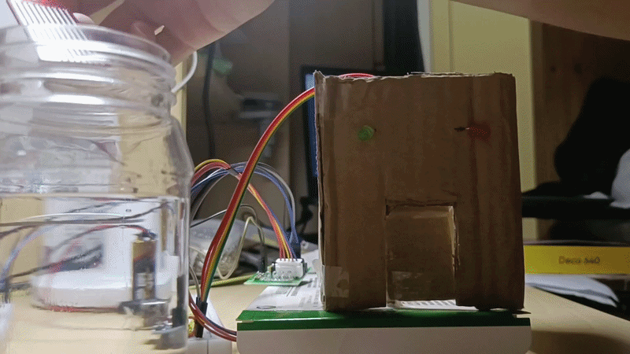
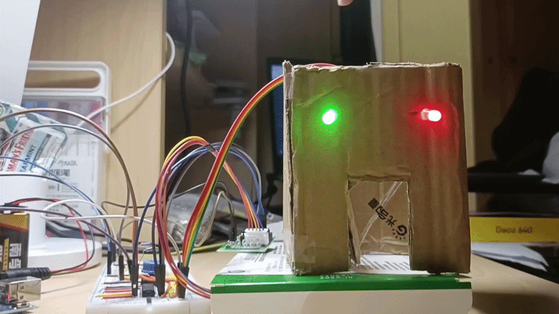

# Password Protected Door Lock With Emergency Hydro-lock

An embedded access control system featuring a 4x4 matrix keypad input, automated door control using a shift register, and a prioritized, emergency escape routine triggered by liquid detection of the water sensor.

### System Demonstration

| Password Opening Door | Emergency State When Leak is Detected | Resetting Emergency State |
| :---: | :---: | :---: |
|  |  |  |

## 🛠️ Technical Stack & Hardware Architecture
* **Microcontroller:** Arduino Uno (ATmega328P)
* **Driver ICs:** 74HC595 (8-bit Latched Shift Register), ULN2003 Darlington Transistor Array
* **Actuator:** 28BYJ-48 Unipolar Stepper Motor (Configured for 4-step sequence)
* **Sensors & Inputs:** HW-038 Leak Sensor, 4x4 Matrix Keypad, Manual Push-Button
* **Firmware Language:** C++ / Arduino Wire

### Pin Configuration Matrix

| Component | Arduino Pin | Control Logic / Mode | Description |
| :--- | :--- | :--- | :--- |
| **Reset Button** | `A2` | `INPUT_PULLUP` (Active-Low) | Hardware Emergency Reset Link |
| **Leak Sensor VCC** | `A0` | `OUTPUT` | Gated Power to minimize sensor oxidation |
| **Leak Sensor Signal** | `A1` | `INPUT_ANALOG` | ADC conversion for moisture tracking |
| **Danger Status LED** | `10` | `OUTPUT` (PWM Capable) | High-visibility emergency indicator |
| **74HC595 Latch (ST_CP)** | `13` | `OUTPUT` | Latches data to storage register |
| **74HC595 Clock (SH_CP)** | `12` | `OUTPUT` | Shifts serial data into shift register |
| **74HC595 Data (DS)** | `11` | `OUTPUT` | Serial data input line |
| **Matrix Keypad Rows** | `5, 4, 3, 2` | `INPUT` / Scanning | Matrix scanning row pins |
| **Matrix Keypad Columns**| `6, 7, 8, 9` | `OUTPUT` / Scanning | Matrix scanning column pins |

---

## ⚙️ Core Engineering Principles Implemented

### 1. Life Safety Fail-Safe (Software Interlock)
The system shifts into a **Fail-Safe** emergency operation upon detecting water using the water sensor. The moment liquid is detected, the standard loop breaks, the entry keypad is physically locked out, and the system autonomously triggers an full opening loop of the door to prevent occupants inside from being trapped in a flooded zone.

# Fail-Safe Smart Access Control System with Emergency Hydro-Interlock

An embedded access control system featuring a 4x4 matrix keypad input, automated door actuation via a latched shift register, and a prioritized, active-low emergency escape routine triggered by environmental liquid detection.

## 🛠️ Technical Stack & Hardware Architecture
* **Microcontroller:** Arduino Uno (ATmega328P)
* **Peripherals & Driver ICs:** 74HC595 (8-bit Latched Shift Register), ULN2003 Darlington Transistor Array
* **Actuator:** 28BYJ-48 Unipolar Stepper Motor (Configured for 4-step sequence)
* **Sensors & Inputs:** HW-038 Soil Moisture/Leak Sensor, 4x4 Matrix Keypad, Manual Push-Button
* **Firmware Language:** C++ / Arduino Wire

### Pin Configuration Matrix

| Peripheral Component | Arduino Pin | Control Logic / Mode | Description |
| :--- | :--- | :--- | :--- |
| **Reset Button** | `A2` | `INPUT_PULLUP` (Active-Low) | Hardware Emergency Reset Link |
| **Leak Sensor VCC** | `A0` | `OUTPUT` | Gated Power to minimize sensor oxidation |
| **Leak Sensor Signal** | `A1` | `INPUT_ANALOG` | ADC conversion for moisture tracking |
| **Danger Status LED** | `10` | `OUTPUT` (PWM Capable) | High-visibility emergency indicator |
| **74HC595 Latch (ST_CP)** | `13` | `OUTPUT` | Latches data to storage register |
| **74HC595 Clock (SH_CP)** | `12` | `OUTPUT` | Shifts serial data into shift register |
| **74HC595 Data (DS)** | `11` | `OUTPUT` | Serial data input line |
| **Matrix Keypad Rows** | `5, 4, 3, 2` | `INPUT` / Scanning | Matrix scanning row pins |
| **Matrix Keypad Columns**| `6, 7, 8, 9` | `OUTPUT` / Scanning | Matrix scanning column pins |

---

## ⚙️ Core Engineering Principles Implemented

### 1. Life Safety Fail-Safe (Software Interlock)
In compliance with fundamental architectural safety standards (similar to NFPA 101 Life Safety guidelines), the system shifts into a **Fail-Safe** operational profile upon hazard detection. The moment liquid thresholds cross a calibrated limit (`ADC < 700`), the standard loop breaks, the entry keypad is physically locked out, and the system autonomously triggers an full opening loop to prevent occupants from being trapped in a flooded zone.

### 2. Shift Register Bitmasking & Synchronous Stepper Control
Since there are not enough I/O pins on the microcontroller, the unipolar stepper motor coils along with the green LED are equenced using a 74HC595 8-bit Serial-In-Parallel-Out (SIPO) shift register, with the following sequence
Bit:   Q7   Q6   Q5   Q4   Q3   Q2   Q1   Q0
       [ X ][ X ][ X ][ L ][ M ][ M ][ M ][ M ]
                        |    |    |    |    |
                        |    +----+----+----+---> [Bits 0-3] Stepper Motor Coils (Pin 15, 1, 2, 3)
                        +-----------------------> [Bit 4]  Status Green LED (Pin 4)
* **Rotation of 90°:** The firmware executes a fixed 128-cycle iteration loop using a 4-step sequence array (`B00010001` to `B00011000`). This yields the step count required rotate the motor exactly 90-degrees to open the door.
* **Default State after Emergency is Over:** To close the door again upon emergency clearance, the phase commutation steps are shown in reverse order, which drives the rotor 90°, back to its baseline secure position.
* **Holding State Optimization:** During the stationary open interval, we use B00010000 to completely de-energize the  motor coils while keeping the green LED latched high. This prevents the stator from overheating due to constant current draw.
  
### 3. Active-Low Pull-Up Implementation
The physical manual reset button utilizes internal ATmega328P pull-up structures (`INPUT_PULLUP`). Pulling the pin high internally avoids floating-state electromagnetic interference (EMI). This ensures an inversion where a logic `LOW` indicates explicit human interaction.

##  Project Directory Structure
├── src/
│   └── smart_access_control.ino   # Main embedded C++ loop logic
├── hardware/
│   └── schematics.pdf             # Wiring diagrams and I/O connections
├── README.md                      # Project documentation and engineering report
